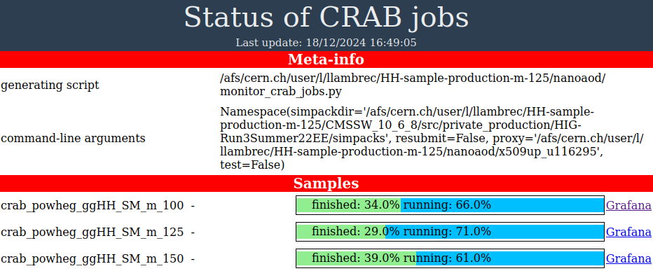

# Private sample production

## Introduction
This is a repository for private CMS sample production.
It is developed for samples with double H boson production decaying to 4 b-quarks with early Run-3 conditions,
but should be generalizable to any other sample as long as the correct gridpack, generator fragment and condition processing sequence are provided.

## References
- This repo was originally forked from the [private production repo by Evan Koenig](https://github.com/ekoenig4/private_production).
- The appropriate processing sequences can be retrieved from here [this PdmV TWiki](https://twiki.cern.ch/twiki/bin/view/CMS/PdmVRun3Analysis) (for early Run-3, presumably similar pages exist for other data-taking eras).
- A more 'official' repo with similar functionality appears to exist [here](https://gitlab.cern.ch/shjeon/sample_factory). Still to look into it.

## Prerequisites

**Gridpack:** The sample generation needs a gridpack (i.e. a compiled standalone version of a matrix element event generator) to start from.
How to generate a gridpack depends on the process and generator of interest, and if you don't have instructions or an example to start from, it is best to consult an expert.
For the original use case of this repository (double H boson production with the Powheg generator), see [this related repo](https://github.com/LukaLambrecht/HH-gridpack-generation) with instructions.

**Generator fragment:** The second ingredient is an appropriate generator fragment (i.e. a config file dealing mostly with the settings for the decays, parton shower, and/or hadronization).
Again it is best to consult an expert on the correct fragment to use.
For the original use case of this repository (double H boson production interfaced with Pythia8 for decays to b-quarks), see the [genfragments/HHto4b_powheg](https://github.com/LukaLambrecht/private-sample-production/tree/main/genfragments/HHto4b_powheg) folder for examples.

**Processing sequence with correct conditions:** The final ingredient is a sequence of `cmsDriver` and `cmsRun` commands that define the whole processing from gridpack to LHE, GEN-SIM, PREMIX, AOD, MiniAOD and finally NanoAOD.
This sequence is dependent on the data-taking conditions, and should be meticulously followed without any alteration if you want to avoid strange and completely uninformative crashes.
See more info on where to get the correct sequence below.
Examples are provided in the [conditions](ttps://github.com/LukaLambrecht/private-sample-production/tree/main/conditions) folder.
Currently there are scripts for 2022 (preEE and postEE) and 2023 (preBPIX and postBPIX), perhaps to extend later.

**This repository:** Download this repo as follows:

```
git clone https://github.com/LukaLambrecht/private-sample-production.git
```

Note: this repo has been developed and used on `lxplus` (and more specifically from an `/afs` home file system).
Some modification might be needed on other systems, depending on the architecture, availability of central CMS software, CRAB settings, etc.

## Get the correct conditions
The appropriate processing sequences can be retrieved from here [this PdmV TWiki](https://twiki.cern.ch/twiki/bin/view/CMS/PdmVRun3Analysis).
This page is for early Run-3, presumably similar pages exist for other data-taking eras.

A slightly more general approach (in case a useful summary TWiki page such as above does not exist) is as follows:
- First find a representative dataset on [GrASP](https://cms-pdmv-prod.web.cern.ch/grasp) for the desired era. Follow the link to McM.
- Alternatively, find a representative sample on DAS, follow the link to McM, and navigate to the corresponding chain.
- From the McM page of each step in the chain, use the second button ('Get setup command') under the action menu to get the correct `cmsDriver` command.

## Make a simpack
A simpack is a folder containing the gridpack, generator fragment, processing script, and any other files that might be needed.
It is a standalone entity that can be shipped to CRAB for sample generation.

Go inside the [run](https://github.com/LukaLambrecht/private-sample-production/tree/main/run) directory and run `python3 build_simpack.py`.
Use the argument `-h` to see a list of all available command line options with a brief explanation.
The most important ones are:
- `-g`: provide the path to the gridack to start event generation from.
- `-f`: provide the path to an appropriate generator fragment.
- `-c`: provide the path to the folder containing the condition-dependent processing sequence and potential auxiliary files.
Typically this path would be of the form `-c ../conditions/conditions-<era>`.
The provided directory must contain a `nanoaod_run.sh` script containing the sequence to execute,
but do not provide the full path to the `nanoaod_run.sh` file, only to the folder that contains it.
Any other files present in this directory will be copied to the simpack as well.
A notable example of these potential auxiliary files is lists of files with premixed pileup events that are available on disk (see below for a full discussion).
- `--container`: for some CMSSW versions (as defined in the processing sequence), a container is needed.
Not yet sure which container exactly is needed for which CMSSW version, but for now just use `--container cmssw-el8`, which seems to work for the currently implemented conditions.
- `-s`: storage site.
By default, the storage site (where the output files will be stored) is set to `T3_CH_CERNBOX`.
This automatically redirects to your personal `/eos/user/<initial>/<username>` space on `lxplus`.
For other storage sites, the physical path to the output location might be different.
- `-o`: output directory.
Define a directory for the output (within the default output location depending on the storage site).
It does not need to exist yet, it will be automatically created by CRAB if needed.
For example, with `-s` left at default and `-o private-sample-test`, the output files would be stored under `/eos/user/<initial>/<username>/private-sample-test/CRAB_PrivateMC/<sample name>/<timestamp>/0000/`
- The other arguments are self-explanatory.

The simpack will be created under `run/simpacks/<name of the simpack>`.
Before submitting it, it is a good idea to go inside the simpack and check if everyting looks ok
(e.g. the correct fragment, correct processing sequence in `nanoaod_run.sh`, correct CRAB parammeters in `crab_config.py`, etc.).

### Make a range of simpacks in one go
In case you need to submit a range of simpacks (e.g. similar samples with mass variations and for multiple data-taking eras),
this can be done more conveniently using the `build_simpack_loop.py` script (also in the [run](https://github.com/LukaLambrecht/private-sample-production/tree/main/run) directory).
The main input to this script consists of a simple `.txt` file, in which each line has the following structure `<sample name> <path to gridpack> <path to generator fragment> <path to conditions folder>`
(where the different parts are separated by spaces).
The script [run/input/HHto4b_Run3_mHvariations/make_input_file.py](https://github.com/LukaLambrecht/private-sample-production/blob/main/run/input/HHto4b_Run3_mHvariations/make_input_file.py) contains an example of making such a file, but must be adapted to each use case.
The other arguments to `build_simpack_loop.py` are similar to `build_simpack.py`.
Run with the `-h` option for more info.

Note: running `python3 build_simpack_loop.py` with the appropriate arguments will first build all the simpacks, and then ask for confirmation to submit all of them.
In case you skipped the submission, you can do that later without needing to rebuild all the simpacks by running `python3 build_simpack_loop.py -i <folder with simpacks>`
(i.e. by using a folder with simpacks instead of the `.txt` input file).

## Submit the simpack and monitor the progress
After checking that all looks good, submit the simpack simply by going inside and running `./crab_submit.sh`.
Note that you need a valid proxy for this step.
You can make one with `voms-proxy-init --voms cms`.

The status of the CRAB jobs of a particular simpack can be assessed by going inside the simpack and running `./crab_command.sh status crab_logs/<simpack name>`.
You can add the argument `--verboseErrors` for more detailed error reporting, or click the Grafana link for a full overview.

Note: the script `./crab_commnd.sh status` just runs the builtin CRAB command `crab status` in a container.

To streamline this approach in case of many simpacks, a utility script `monitor_crab_jobs.py` (inside the [monitoring](https://github.com/LukaLambrecht/private-sample-production/tree/main/monitoring) folder) is provided that runs the `./crab_command.sh status` script on multiple crab working directories and makes an overview of the results. 
Example usage:

```
python3 monitor_crab_jobs.py -i ../run/simpacks/ -p x509up_u116295 -r
```

This will scan the provided `simpacks` directory and run `./crab_command.sh status` on each of the CRAB working directories inside of it.
The `-p` argument allows you to specify the path to an active proxy, to avoid having to type your password for generating a new one.
In the example above, it was assumed that the proxy was present (e.g. by copying it over) in the `monitoring` directory.
The `-r` argument means that `crab resubmit` should be called on failed jobs.

The output of `monitor_crab_jobs.py` is an `index.html` file which you can open in a web browser, looking something like this:



### Checking causes of job crashes
The reason for crashed jobs can be checked with the `--verboseErrors` arg to `crab status`, as explained above.
Alternatively, click the Grafana link in the textual output of `crab status` (also linked in the overview generated by the `monitor_crab_jobs.py` script).
Scroll to the 'Jobs Table' and click the `JobLog` link next to failed jobs for a full textual output of the job including the error that caused the crash.

### Advanced resubmit options
More advanced resubmit options can be passed to the monitoring script as well, e.g. as follows:

```
python3 monitor_crab_jobs.py -i ../run/simpacks/ -p x509up_u116295 -r --resubmit_args='--siteblacklist=T2_BE_IIHE --maxmemory=3500'
```

Notice the `=` sign and the single quotes; both are needed for this to work correctly.
All resubmit options are documented in [this twiki](https://twiki.cern.ch/twiki/bin/view/CMSPublic/CRAB3Commands#crab_resubmit).

### Running repetitive monitoring and resubmission
The monitoring can be run in a cron job to have frequent (e.g. hourly) status updates without manually having to run the command every time.
Resubmission can be included in this cron job as well, but make sure to not waste resources by resubmitting jobs again and again that keep failing because of a non-transient issue.
For example, add the following to your acronab file (start editing this file with the command `acrontab -e`):

```
0 */4 * * * lxplus.cern.ch cd <path to monitoring directory>; bash monitor_crab_jobs.sh >> <some log file> 2>&1
```

For help with the first 5 elements in this statement, see e.g. [here](https://crontab.guru/).
Check the script `monitor_crab_jobs.sh` for details; it's a simple wrapper around `monitor_crab_jobs.py` with some other convenient settings.
Note that this script assumes that you copied a proxy (that remains valid for the entire time the cron job is active) to the `monitoring` directory.
Slight tweaks of this script could be needed for each use case, e.g. enabling/disabling the `-r` option, or providing `--resubmit_args`.


## Merging CRAB output files

Since events take a long time to generate, the CRAB jobs above are typically limited to O(100) events.
Each job generates a separate ROOT file, but for the next steps it is often more convenient to work with fewer files with more events per file.
Hence it is useful to perform a merging procedure after all CRAB jobs have finished but before continuing to the next step.

For this purpose, use `merge.py` (inside the `merging` folder), or `merge_loop.py` for merging multiple samples in one go.
Run `python3 merge.py -h` to see the command line arguments.

Note that you need to source a relatively recent CMSSW version, as this is required for the `haddnano.py` script to be available.
For example, `CMSSW_14_0_0` seems to work (on a default `lxplus` architecture).
Simply install it somewhere using `cmsrel CMSSW_14_0_0` and provide the path to this CMSSW folder with the `--cmssw` argument to `merge.py` (both for local running as for condor job submission).


## Various notes

### Premixing settings for pileup
The dataset from which premixed pileup events are to be taken must be specified in the conditions,
more specifically in the `cmsDriver` command corresponding to the premixing step.
The easiest way is to use an argument of the form `--pileup_input "dbs:<name of appropriate dataset on DAS>"`,
where the 'appropriate dataset' for the data-taking period of interest should be retrieved from the instructions (if any can be found),
or from an expert.
See [here](https://github.com/LukaLambrecht/private-sample-production/blob/39a16304e6cf9e872b7fba00bcc94789a9a9875f/conditions-2022-preEE/nanoaod_run.sh#L113) for an example.

This simple approach might make a significant fraction of CRAB jobs crash however,
as apparently the 'appropriate datasets' were partly deleted to save disk space.
It is not clear which data-taking periods exactly are affected, but probably all.
Somehow the deleted files still show up in the DAS query (inside the CRAB job),
so that CRAB finds and tries to open a premixed file that turns out not to exist...
For a discussion of this issue, see [this CMS Talk thread](https://cms-talk.web.cern.ch/t/missing-files-for-digipremix-step-runiisummer20ul17-private-production/80581/3),
and an example of a crash caused by this issue is discussed [here](https://cms-talk.web.cern.ch/t/crab-jobs-failing-on-opening-premixing-files/88103/3).

As a solution, one can either keep resubmitting until a satisfactory completion percentage is reached.
This works since CRAB chooses a premixed file at random (?) with every resubmission,
so a fraction of the jobs will succeed because their file turns out to exist.
This might require a large number of resubmissions however, and wastes a lot of resources.

Another solution consists of making a list of all files in a premixed dataset that are actually on disk,
and providing that list to `cmsDriver`.
The list of files should be stored in a simple `.txt` file with one file per line.
A tool for making theses lists for datasets of your choice is provided in `tools/das/check_disk.py`.
Once the list is made, perform the following steps to use it:
- The file name should be passed to `cmsDriver` (in `nanoaod_run.sh`) as follows: `--pileup_input filelist:<name of your txt file>`.
- Make sure this file is present in the simpack.
This can be achieved by adding it in the appropriate conditions folder
(as all files in this folder are automatically copied to the simpack by `build_simpack.py`).
- Make sure the file is transfered to the CRAB sandbox.
This should be handled automatically as long as the file ends in `.txt`
(because of the `*.txt` specification in the `inputFiles` setting in the `crab_config.py` file).
Else, add it manually in the `inputFiles` setting in the `crab_config.py` file.


## Internal notes for HH -> 4b sample generation
- The decay of the H boson to b quarks is specified by the `25:onMode = off` and `25:onIfMatch = 5 -5` parameters in the Pythia fragment.
- The Pythia fragment also has a parameter `POWHEG:nFinal = 3`.
Still to ask if it means what it seems to mean, but should probably be changed to 2.
See e.g. [here](https://cms-pdmv-prod.web.cern.ch/mcm/public/restapi/requests/get_fragment/TSG-Run3Summer22EEwmLHEGS-00013/0) for an example fragment of a central HH sample.
Update from Evan: used to be 2, but changed to 3 for ZH sample.
Not yet fully clear what it means, probably 2 is the right value, but to double check with an expert.
- The Pythia fragment also has an parameter for the H mass.
Not sure what happens if the value in the gridpack and in the Pythia fragment do not agree, but probably best to synchronize them.
